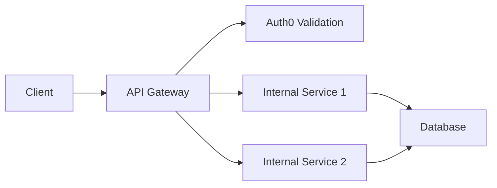
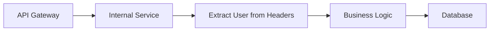

# Resume Match Pro Shared Auth

[](https://github.com/resume-match-pro/shared-auth/actions)
[](https://codecov.io/gh/resume-match-pro/shared-auth)
[](https://www.python.org/downloads/)
[](https://opensource.org/licenses/MIT)

Reusable Auth0 JWT middleware for Resume Match Pro microservices. Provides consistent authentication across all services with minimal setup.

## Features

- 🔐 **Auth0 JWT Validation** - Complete RS256 JWT token validation with JWKS
- 🚀 **FastAPI Integration** - Ready-to-use FastAPI dependencies
- 🏗️ **API Gateway Pattern** - Full JWT validation at gateway, trusted headers for internal services
- 👥 **Role-Based Access Control** - Declarative role and scope checking
- 🏢 **Organization Isolation** - Multi-tenant organization boundary enforcement
- ⚡ **High Performance** - JWKS caching, < 100ms token validation
- 🧪 **Test-Friendly** - Built-in test token support for development
- 📊 **100% Test Coverage** - Comprehensive unit and integration tests

## Quick Start

### Installation

```bash
# Using uv (recommended) - from Azure Artifacts
uv add resume-match-shared-auth --index-url https://pkgs.dev.azure.com/resumematch/_packaging/shared-packages/pypi/simple/

# Using pip - from Azure Artifacts
pip install resume-match-shared-auth --index-url https://pkgs.dev.azure.com/resumematch/_packaging/shared-packages/pypi/simple/
```

### API Gateway Usage (Full JWT Validation)

```python
from fastapi import FastAPI, Depends
from shared_auth import Auth0Middleware, AuthUser, require_auth

app = FastAPI()

# Initialize Auth0 middleware
auth = Auth0Middleware(
    domain="your-tenant.auth0.com",
    api_identifier="https://your-api.com"
)

@app.get("/protected")
async def protected_endpoint(user: AuthUser = Depends(require_auth)):
    return {"user_id": user.user_id, "email": user.email}

@app.get("/admin-only")
async def admin_endpoint(user: AuthUser = Depends(require_admin)):
    return {"message": "Admin access granted"}
```

### Internal Service Usage (Trust Gateway Headers)

```python
from fastapi import FastAPI, Depends, Request
from shared_auth import AuthUser, require_auth, get_user_from_headers

app = FastAPI()

@app.middleware("http")
async def trust_gateway_middleware(request: Request, call_next):
    # Extract user context from gateway headers
    user = get_user_from_headers(dict(request.headers))
    request.state.user = user
    return await call_next(request)

@app.get("/documents")
async def list_documents(user: AuthUser = Depends(require_auth)):
    return get_user_documents(user.user_id)
```

## Configuration

### Environment Variables

```bash
# Required
AUTH0_DOMAIN=your-tenant.auth0.com
AUTH0_API_IDENTIFIER=https://your-api.com

# Optional
AUTH0_ALGORITHMS=RS256
FASTAPI_ENV=production

# Testing (strict security - both required for mock tokens)
FASTAPI_ENV=testing
ALLOW_MOCK_TOKENS=true
LOCAL_TEST_TOKEN=your-test-token
```

### Startup Validation

```python
from shared_auth import validate_auth0_config

# Validate configuration at application startup
try:
    config = validate_auth0_config()
    print("✅ Auth0 configuration valid")
except ConfigurationError as e:
    print(f"❌ Configuration error: {e}")
    raise
```

### OpenTelemetry Tracing

The library automatically adds OpenTelemetry tracing spans for authentication operations:

```python
# Tracing spans created automatically:
# - auth.get_jwks (JWKS fetching with cache info)
# - auth.verify_jwt_token (JWT verification with user context)

# Span attributes include:
# - auth.user_id, auth.email
# - auth.audience, auth.issuer
# - auth.error_type (for failures)
# - auth.jwks_cache_hit (cache performance)
```

## Versioning

Version is managed in a single `VERSION` file containing the full semantic version (e.g., `0.1.0`). Minor versions auto-increment on each release, major versions require manual trigger via GitHub Actions.

### Programmatic Configuration

```python
from shared_auth import Auth0Middleware

# Explicit configuration
auth = Auth0Middleware(
    domain="your-tenant.auth0.com",
    api_identifier="https://your-api.com",
    algorithms=["RS256"],
    cache_jwks=True,
    jwks_cache_ttl=3600
)
```

## Usage Patterns

### Role-Based Access Control

```python
from shared_auth import require_role, require_any_role, require_all_roles

# Require specific role
require_manager = require_role("manager")

@app.get("/manager/reports")
async def get_reports(user: AuthUser = Depends(require_manager)):
    return get_manager_reports(user.user_id)

# Require any of multiple roles
require_staff = require_any_role(["admin", "manager", "staff"])

@app.get("/staff/dashboard")
async def staff_dashboard(user: AuthUser = Depends(require_staff)):
    return get_staff_dashboard(user.user_id)

# Require all specified roles
require_super_admin = require_all_roles(["admin", "super_user"])

@app.delete("/admin/system/reset")
async def system_reset(user: AuthUser = Depends(require_super_admin)):
    return perform_system_reset()
```

### Scope-Based Access Control

```python
from shared_auth import require_scope

# Require specific OAuth2 scope
require_write_docs = require_scope("write:documents")

@app.post("/documents")
async def create_document(
    document: dict,
    user: AuthUser = Depends(require_write_docs)
):
    return create_user_document(user.user_id, document)

# Pre-defined scope dependencies
from shared_auth import (
    require_read_documents,
    require_write_documents,
    require_delete_documents
)

@app.delete("/documents/{doc_id}")
async def delete_document(
    doc_id: str,
    user: AuthUser = Depends(require_delete_documents)
):
    return delete_user_document(user.user_id, doc_id)
```

### Organization Access Control

```python
from shared_auth import require_organization_member, require_organization_access

# Require user to belong to any organization
@app.get("/org/documents")
async def list_org_documents(
    user: AuthUser = Depends(require_organization_member)
):
    return get_documents_for_org(user.organization_id)

# Require access to specific organization
@app.get("/org/{org_id}/documents")
async def get_org_documents(
    org_id: str,
    user: AuthUser = Depends(require_organization_access(org_id))
):
    return get_documents_for_org(org_id)
```

### Custom Dependencies

```python
from shared_auth import require_auth
from fastapi import HTTPException

def require_document_owner(doc_id: str):
    async def check_ownership(user: AuthUser = Depends(require_auth)):
        document = get_document(doc_id)
        if document.owner_id != user.user_id:
            raise HTTPException(status_code=403, detail="Not document owner")
        return user
    return check_ownership

@app.put("/documents/{doc_id}")
async def update_document(
    doc_id: str,
    updates: dict,
    user: AuthUser = Depends(require_document_owner(doc_id))
):
    return update_user_document(doc_id, updates)
```

## AuthUser Model

The `AuthUser` model provides comprehensive user context:

```python
from shared_auth import AuthUser

user = AuthUser(
    user_id="123e4567-e89b-12d3-a456-426614174000",
    email="user@example.com",
    organization_id="org-456",
    roles=["admin", "member"],
    auth0_subject="auth0|user123",
    email_verified=True,
    scopes=["read:documents", "write:documents"]
)

# Properties
user.is_admin                    # True if "admin" in roles
user.is_organization_member      # True if organization_id is not None
user.has_verified_email         # True if email_verified is True

# Methods
user.has_role("admin")          # Check specific role
user.has_scope("read:docs")     # Check specific scope
user.has_any_role(["admin", "manager"])  # Check any of multiple roles
user.has_all_roles(["admin", "member"])  # Check all roles required

# Serialization
user_dict = user.to_dict()      # Convert to dictionary
user = AuthUser.from_dict(data) # Create from dictionary
```

## Testing

### Test Token Support

The package includes built-in test token support for development and testing:

```python
# Environment setup for testing
import os
os.environ["FASTAPI_ENV"] = "testing"
os.environ["LOCAL_TEST_TOKEN"] = "local-test-123"

# Use test tokens in requests
headers = {"Authorization": "Bearer local-test-123"}
headers = {"Authorization": "Bearer mock-test-user-456"}
headers = {"Authorization": "Bearer mock-legacy-token"}
```

### Test Utilities

```python
from shared_auth import AuthUser

# Create test users
test_user = AuthUser(
    user_id="test-user-123",
    email="test@example.com",
    roles=["member"],
    scopes=["read:documents"]
)

# Mock headers for internal services
test_headers = {
    "X-User-ID": "test-user-123",
    "X-User-Email": "test@example.com",
    "X-User-Roles": "member,staff",
    "X-User-Scopes": "read:documents write:documents"
}
```

### Running Tests

```bash
# Install test dependencies
uv pip install -e ".[test]"

# Run all tests
uv run pytest

# Run with coverage
uv run pytest --cov=src/shared_auth --cov-report=html

# Run specific test categories
uv run pytest -m unit
uv run pytest -m integration
uv run pytest -m performance
uv run pytest -m security
```

## Error Handling

The package provides structured error responses:

```python
from shared_auth.exceptions import (
    AuthenticationError,
    InvalidTokenError,
    ExpiredTokenError,
    InsufficientScopeError,
    InsufficientRoleError,
    MissingClaimError,
    OrganizationAccessError,
    ConfigurationError
)

# All exceptions provide structured error dictionaries
try:
    user = await verify_token(credentials)
except InvalidTokenError as e:
    error_dict = e.to_dict()
    # {
    #     "success": False,
    #     "error": {
    #         "code": "INVALID_TOKEN",
    #         "message": "Invalid authentication token",
    #         "details": {...}
    #     }
    # }
```

## Performance

- **Token Validation**: < 100ms (95th percentile)
- **Memory Usage**: < 10MB per service instance
- **Concurrent Requests**: 1000+ requests/second
- **JWKS Caching**: Automatic with configurable TTL

## Security Features

- **RS256 JWT Validation** with Auth0 JWKS
- **Token Expiration** checking
- **Audience Validation** to prevent token reuse
- **Issuer Validation** to ensure tokens from correct Auth0 tenant
- **Organization Isolation** for multi-tenant security
- **Role-Based Access Control** with fine-grained permissions
- **Scope-Based Access Control** for OAuth2 compliance

## Architecture Patterns

### API Gateway Pattern



The API Gateway validates JWT tokens once and adds user context to headers for internal services.

### Internal Service Pattern



Internal services trust the API Gateway and extract user context from HTTP headers.

## Migration Guide

### From document-service auth middleware

```python
# Old way (document-service specific)
from middleware.auth0_middleware import verify_token, get_current_user_id

@app.get("/documents")
async def list_docs(user_id: str = Depends(get_current_user_id)):
    return get_user_documents(user_id)

# New way (shared-auth)
from shared_auth import require_auth, AuthUser

@app.get("/documents")
async def list_docs(user: AuthUser = Depends(require_auth)):
    return get_user_documents(user.user_id)
```

### Benefits of Migration

- **Consistent API** across all services
- **Enhanced Features** (roles, scopes, organization isolation)
- **Better Testing** with built-in test token support
- **Improved Performance** with optimized caching
- **Comprehensive Documentation** and examples

## Contributing

1. Fork the repository
2. Create a feature branch (`git checkout -b feature/amazing-feature`)
3. Make your changes
4. Add tests for new functionality
5. Ensure all tests pass (`uv run pytest`)
6. Commit your changes (`git commit -m 'Add amazing feature'`)
7. Push to the branch (`git push origin feature/amazing-feature`)
8. Open a Pull Request

### Development Setup

```bash
# Clone the repository
git clone https://github.com/resume-match-pro/shared-auth.git
cd shared-auth

# Install development dependencies
uv pip install -e ".[test,dev]"

# Install pre-commit hooks
pre-commit install

# Run tests
uv run pytest

# Run linting
uv run black src/ tests/
uv run isort src/ tests/
uv run flake8 src/ tests/
uv run mypy src/shared_auth/
```

## License

This project is licensed under the MIT License - see the [LICENSE](LICENSE) file for details.

## Support

- **Documentation**: [GitHub README](https://github.com/resume-match-pro/shared-auth#readme)
- **Issues**: [GitHub Issues](https://github.com/resume-match-pro/shared-auth/issues)
- **Discussions**: [GitHub Discussions](https://github.com/resume-match-pro/shared-auth/discussions)

## Changelog

### v0.1.0 (Initial Release)

- Auth0 JWT validation with JWKS support
- FastAPI dependencies for authentication and authorization
- Role-based and scope-based access control
- Organization isolation for multi-tenant applications
- API Gateway and Internal Service patterns
- Comprehensive test suite with 100% coverage
- Performance optimizations with JWKS caching
- Built-in test token support for development
- Complete documentation and examples
